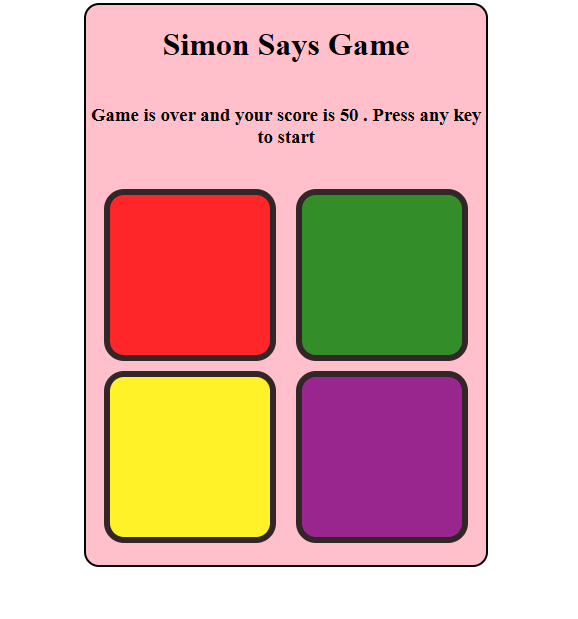

# Simon Says Game

Welcome to the Simon Says game! This project is a web-based implementation of the classic electronic memory game, Simon. The game challenges players to repeat increasingly complex sequences of lights and sounds.

# Game Overview

Simon Says is a memory game where players must replicate a sequence of tones and lights. Each round, the game adds one more step to the sequence, and the player must remember and reproduce the sequence correctly. The game ends when the player makes a mistake.

# User Interface

</img>
 

 

 </img>

# Features

Interactive User Interface: Visually appealing and responsive design. 
Score Tracking: Keeps track of the player's current and highest scores. 

# Installation

To run this game locally, follow these steps: 

Clone the repository:

<pre>

Copy code
git clone <a> https://github.com//tapeshchavle/SimonSay-Game.git</a>
Navigate to the project directory:

Copy code
cd simon-says-game
Open index.html in your preferred web browser.
</pre>

# How to Play

Press any of the button of the key bord. 
Repeat the sequence by clicking the colored buttons in the correct order. 
The game will add one more step to the sequence after each successful round. 
The game ends if you make a mistake. Try to beat your high score! 

<h2>Project Structure</h2>
graphql
Copy code  
<pre>
simon-says-game/
├── simon.html      # The main HTML file
├── simon.css      # The CSS file for styling
├── simon.js       # The JavaScript file for game logic 
└── README.md       # The README file (this file)
</pre>

# Technologies Used

HTML: For structuring the web page. 
CSS: For styling the game. 
JavaScript: For game logic and interactivity. 

# Contributing

Contributions are welcome! If you would like to contribute, please follow these steps:

# Fork the repository.

Create a new branch (git checkout -b feature-branch). 
Make your changes and commit them (git commit -am 'Add new feature'). 
Push to the branch (git push origin feature-branch). 
Create a new Pull Request. 

# Contact

If you have any questions or suggestions, please feel free to contact me at tapeshchawle@gmail.com.
